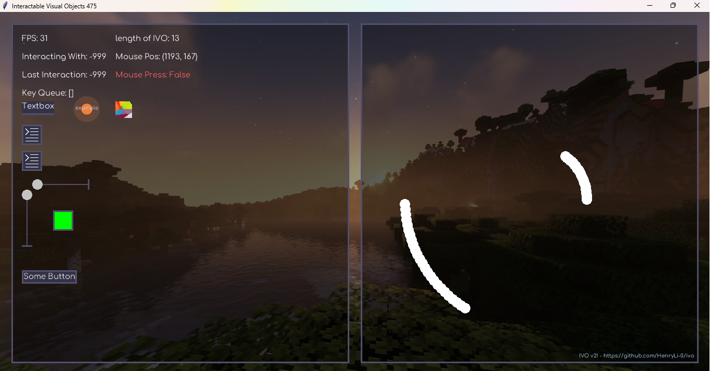

# ivo

interactable visual objects

The tk window system behind [Tape](https://github.com/HenryLi-0/tape/) and [Protoplop](https://github.com/HenryLi-0/protoplop/) isolated and given a name so that i dont spend another three hours running around the code with a sledgehammer.

### Getting Started:

First, make sure you have all the neccesary python modules installed to run this! (Any modules that don't come with python are listed below!) Then, either clone this repository, or download a recent release from the releases tab, and run [`main.py`](/main.py)! Most of the docs are inside the code! Head to [`interface.py`](/subsystems/interface.py) to get started coding!

### Modules Used (that dont come with python):
- numpy
- PIL (Pillow)
